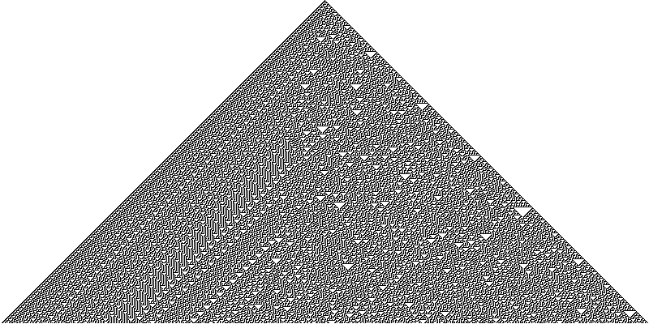

# Elementary cellular automaton

[wiki](https://en.wikipedia.org/wiki/Elementary_cellular_automaton)

# How to use

```
cargo install eca
```

```bash
eca 110                # output in a png called output.png
eca 110 -o result.png  # specify name
eca 110 -o result.txt  # write to a text file
```

# Rule 90



# Rule 110 with random init


